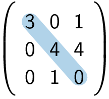
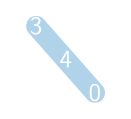

Het **spoor** van een matrix (ook wel *trace* genoemd) is de som van de elementen van de **hoofddiagonaal** van een **vierkante matrix**.

Voor onderstaande matrix geldt bijvoorbeeld dat het spoor gelijk is aan 7.

{:data-caption="Het spoor van een vierkante matrix." .light-only height="100px"}

{:data-caption="Het spoor van een vierkante matrix." .dark-only height="100px"}

## Gevraagd
Schrijf een functie `spoor(matrix)` dat gegeven een matrix als een twee dimensionale lijst het spoor uitrekent.

#### Voorbeeld

```python
>>> spoor([[3, 0, 1], 
           [0, 4, 4], 
           [0, 1, 0]])
7
```