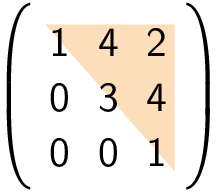
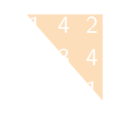

Een bovendriehoeksmatrix is een vierkante matrix waarbij alle elementen **onder** de hoofdiagonaal nul zijn. Hieronder vind je een voorbeeld van zo'n matrix.

{:data-caption="Een bovendriehoeksmatrix." .light-only height="100px"}

{:data-caption="Een bovendriehoeksmatrix." .dark-only height="100px"}

## Gevraagd
Schrijf een functie `is_bovendriehoek(matrix)` dat controleert of een gegeven matrix al dan niet een bovendriehoekmatrix is.

#### Voorbeelden

```python
>>> is_bovendriehoek([[1, 4, 2], 
                      [0, 3, 4], 
                      [0, 0, 1]])
True
```

```python
>>> is_bovendriehoek([[1, 0, 2], 
                      [0, 3, 4], 
                      [1, 0, 1]])
False
```