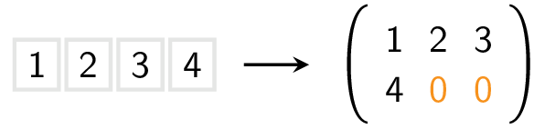

Gegeven een lijst met getallen, vorm deze om naar een 2D-lijst met `K` kolommen. Vul de 2D-lijst desnoods aan met `0`'en.

Er geldt bijvoorbeeld dat de volgende lijst omgevormd kan worden naar een matrix met drie kolommen.

{:data-caption=Een lijst omgevormd naar een matrix." .light-only height="100px"}

{:data-caption="Een lijst omgevormd naar een matrix." .dark-only height="100px"}

## Gevraagd
Schrijf een functie `vorm_om(lijst, K)` dat gegeven een lijst, deze omvormt naar een matrix met `K` kolommen. Vul desnoods aan met nullen.

Bestudeer grondig onderstaande voorbeelden:

#### Voorbeelden

```python
>>> vorm_om([1, 2, 3, 4], 3)
[[1, 2, 3],
 [4, 0, 0]]
```


```python
>>> vorm_om([1, 2, 3, 4], 2)
[[1, 2],
 [3, 4]]
```