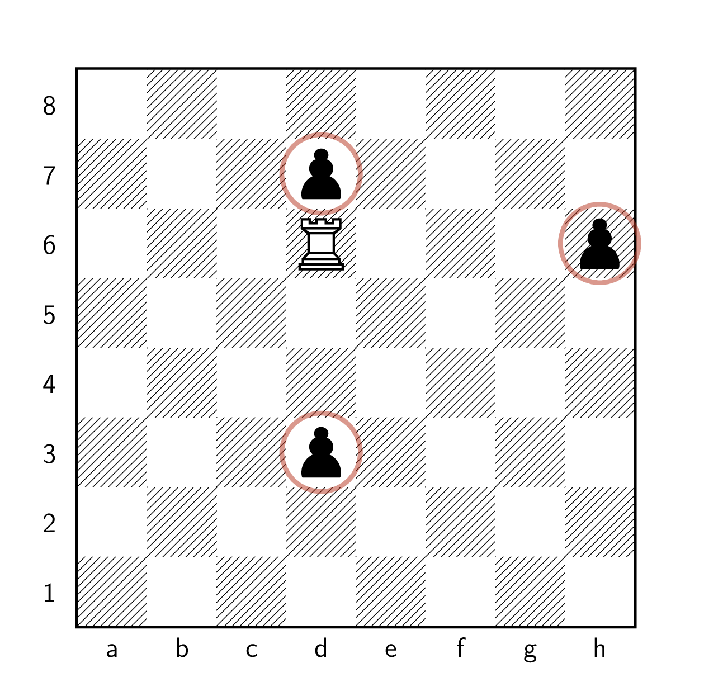
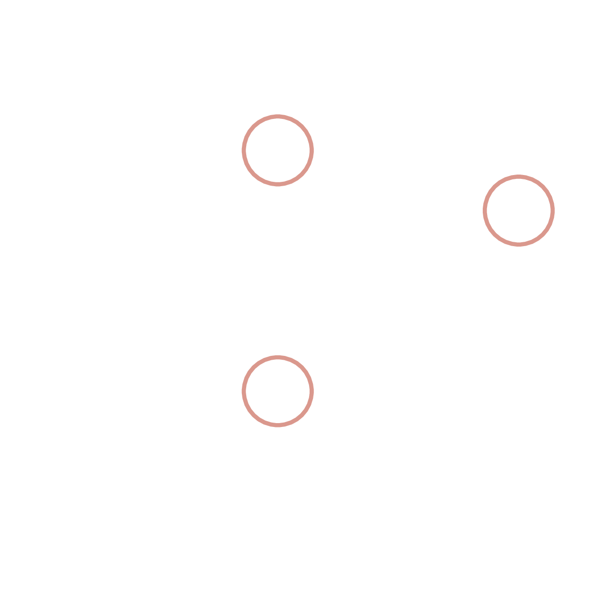
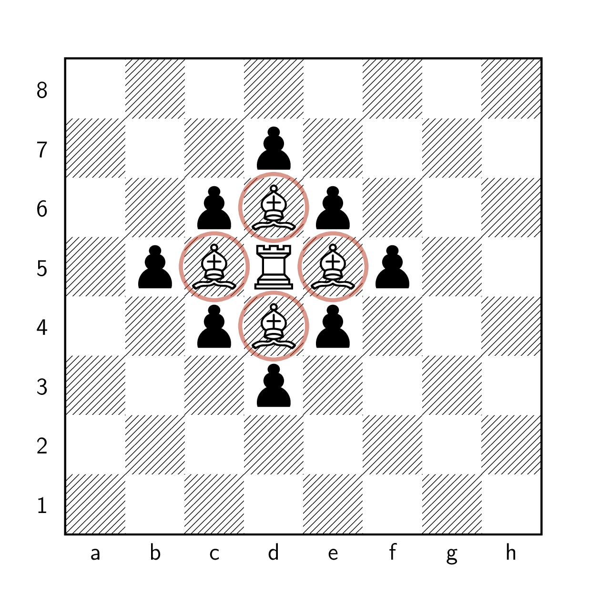
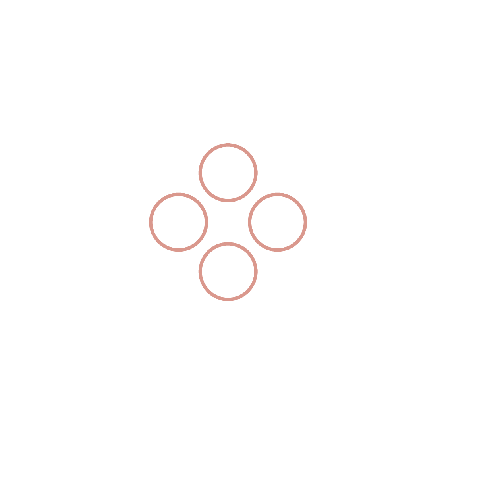
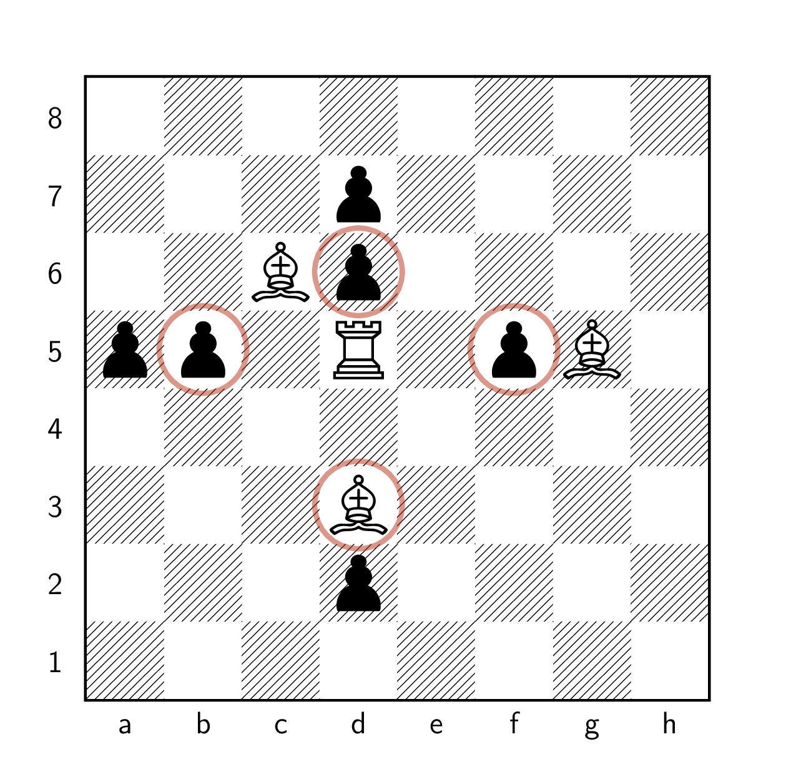
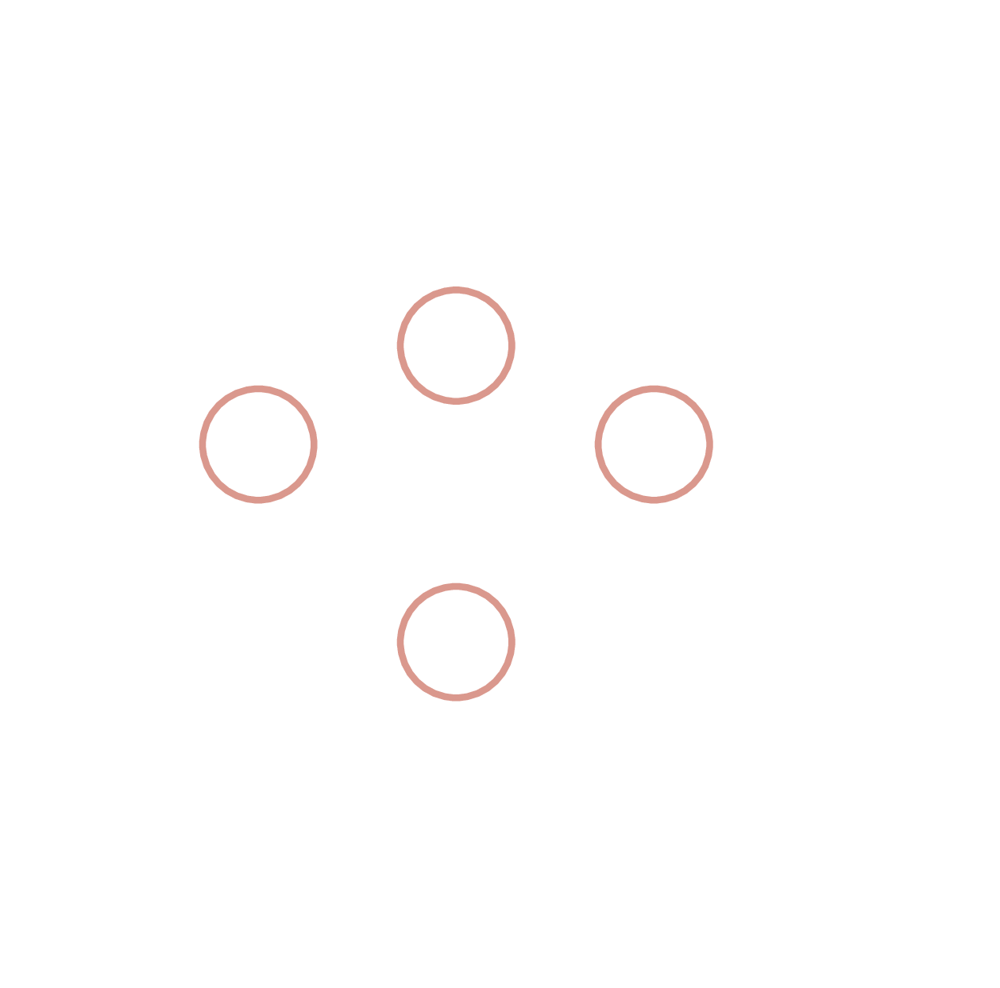

Gegeven de voorstelling van een schaakbord met één toren en enkele andere schaakstukken. Hoeveel pionnen van het andere kleur kan deze toren dan nemen?

## Gevraagd
Schrijf een functie `toren(schaakbord)` waarbij het schaakbord gegeven wordt als een rooster, waarbij de toren met een `"T"` en de pionnen van de andere kleur met een `"p"` worden voorgesteld. Er kunnen zich ook lopers `"L"` op het bord bevinden. (die bijvoorbeeld de weg naar een pion blokeert.)

Geef het **aantal pionnen** dat de toren kan nemen.

Bestudeer grondig onderstaande voorbeelden:

#### Voorbeelden

{:data-caption="Voorbeeld 1." .light-only width="30%"}

{:data-caption="Voorbeeld 1." .dark-only width="30%"}

In deze situatie kan de toren drie pionnen nemen.

```python
>>> toren([[" ", " ", " ", " ", " ", " ", " ", " "],
           [" ", " ", " ", "p", " ", " ", " ", " "],
           [" ", " ", " ", "T", " ", " ", " ", "p"],
           [" ", " ", " ", " ", " ", " ", " ", " "],
           [" ", " ", " ", " ", " ", " ", " ", " "],
           [" ", " ", " ", "p", " ", " ", " ", " "],
           [" ", " ", " ", " ", " ", " ", " ", " "],
           [" ", " ", " ", " ", " ", " ", " ", " "]])
3
```


{:data-caption="Voorbeeld 2." .light-only width="30%"}

{:data-caption="Voorbeeld 2." .dark-only width="30%"}

In deze situatie kan de toren **geen enkele pion** nemen. Alle pionnen worden geblokkeerd door een loper.

```python
>>> toren([[" ", " ", " ", " ", " ", " ", " ", " "],
           [" ", " ", " ", "p", " ", " ", " ", " "],
           [" ", " ", "p", "L", "p", " ", " ", " "],
           [" ", "p", "L", "T", "L", "p", " ", " "],
           [" ", " ", "p", "L", "p", " ", " ", " "],
           [" ", " ", " ", "p", " ", " ", " ", " "],
           [" ", " ", " ", " ", " ", " ", " ", " "],
           [" ", " ", " ", " ", " ", " ", " ", " "]])
0
```


{:data-caption="Voorbeeld 3." .light-only width="30%"}

{:data-caption="Voorbeeld 3." .dark-only width="30%"}

In deze situatie kan de toren drie pionnen nemen. De bovenste pion wordt geblokkeerd door de pion eronder. De laagste pion wordt geblokkeerd door de loper erboven.

```python
>>> toren([[" ", " ", " ", " ", " ", " ", " ", " "],
           [" ", " ", " ", "p", " ", " ", " ", " "],
           [" ", " ", "L", "p", "p", " ", " ", " "],
           ["p", "p", " ", "T", " ", "p", "L", " "],
           [" ", " ", " ", " ", " ", " ", " ", " "],
           [" ", " ", " ", "L", " ", " ", " ", " "],
           [" ", " ", " ", "p", " ", " ", " ", " "],
           [" ", " ", " ", " ", " ", " ", " ", " "]])
3
```