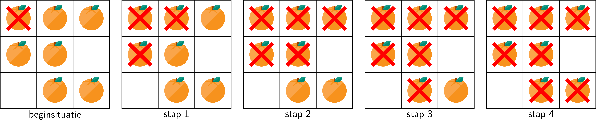
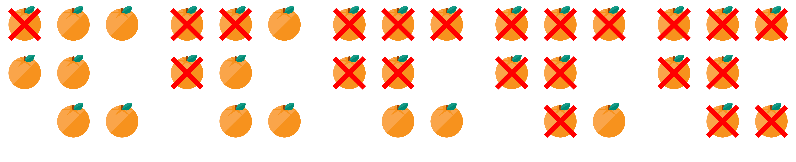
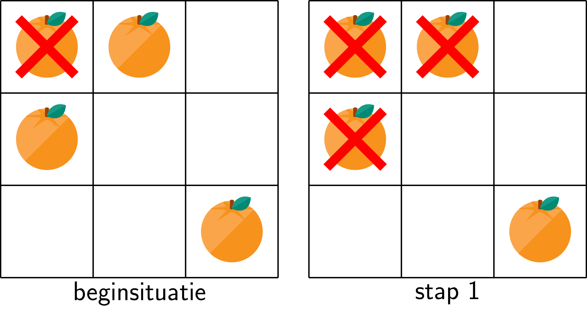
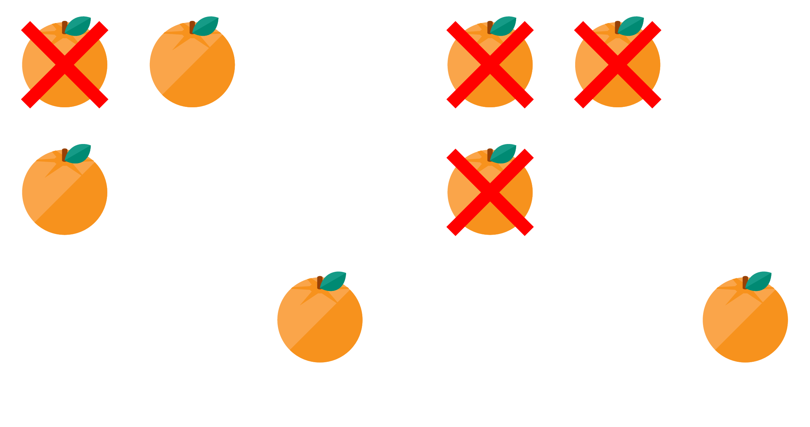

Gegeven is een m × n rooster, waarbij elke cel één van de volgende waarden heeft:

- `0` indien het een lege cel voorstelt,
- `1` indien het een verse sinaasappel voorstelt,
- `2` indien het een rotte sinaasappel voorstelt.

In elke stap begint fruit dat aan een stuk rot fruit grenst ook te rotten.
Het doel is om het minimaal aantal stappen te zoeken opdat de fruitschaal enkel rot fruit bevat.

## Gevraagd
Dit probleem pak je best gestructureerd aan, door meerdere aparte functies aan te maken. In elke functie focus je je op één aspect van het probleem.

Schrijf een functie `aantal_vers(rooster)` dat nagaat **hoeveel** vers fruit er nog in het rooster zit.

Schrijf een functie `stap(rooster)` die één enkele stap implementeert. 

Schrijf een functie `rot_fruit(rooster)` dat gegeven het rooster het minimaal aantal dagen bepaalt zodat het rooster enkel rot fruit bevat. Indien dit onmogelijk is, retourneer dan -1.

Bestudeer zorgvuldig onderstaande voorbeelden.

#### Voorbeelden

{:data-caption="Evolutie van een fruitschaal." .light-only height="3%"}

{:data-caption="Evolutie van een fruitschaal." .dark-only height="3%"}

Bij deze fruitschaal duurt het 4 stappen, tot de ganse schaal enkel rot fruit bevat.

```python
>>> rot_fruit([[2, 1, 1],
               [1, 1, 0],
               [0, 1, 1]])
4
```

De hulpfuncties `aantal_vers(rooster)` en `stap(rooster)` werken als volgt:
```python
>>> aantal_vers([[2, 1, 1],
                 [1, 1, 0],
                 [0, 1, 1]])
6
```

```python
>>> stap([[2, 1, 1],
          [1, 1, 0],
          [0, 1, 1]])
[[2, 2, 1],
 [2, 1, 0],
 [0, 1, 1]]
```

{:data-caption="Evolutie van een fruitschaal." .light-only height="5%"}

{:data-caption="Evolutie van een fruitschaal." .dark-only height="5%"}

Elk stuk fruit rot maken is onmogelijk in deze fruitschaal. Het stuk fruit rechtsonder grenst immers nooit aan ander stuk rot fruit.

```python
>>> rot_fruit([[2, 1, 0],
               [1, 0, 0],
               [0, 0, 1]])
-1
```

De hulpfuncties `aantal_vers(rooster)` en `stap(rooster)` werken hier als volgt:
```python
>>> aantal_vers([[2, 1, 0],
                 [1, 0, 0],
                 [0, 0, 1]])
3
```

```python
>>> stap([[2, 1, 0],
          [1, 0, 0],
          [0, 0, 1]])
[[2, 2, 0],
 [2, 0, 0],
 [0, 0, 1]]
```