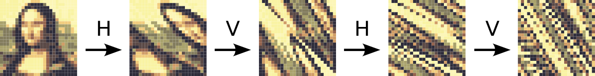
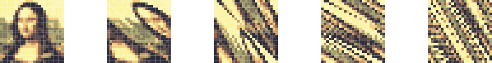

Leo heeft een nieuwe methode uitgevonden voor het versleutelen van afbeeldingen met behulp van de bewerkingen H (horizontaal) en V (verticaal). Een afbeelding is in principe een rooster met rijen en kolommen van vierkante cellen die pixels worden genoemd, waarbij elke pixel een kleur opslaat.

In elke toepassing van de H-bewerking:

- Blijft elke pixel in de 1e rij op zijn plaats (d.w.z. ze bewegen niet).
- Schuift elke pixel in de 2e rij 1 plaats naar rechts.
- Schuift elke pixel in de 3e rij 2 plaatsen naar rechts.
- Schuift elke pixel in de n-de rij n−1 plaatsen naar rechts.

Wanneer pixels in een rij voorbij de rechterrand van de afbeelding worden geschoven, worden ze op volgorde gehouden en als een groep verplaatst naar de beschikbare ruimte aan de linkerkant van de rij. Hier is een voorbeeld van een afbeelding van 3 x 3 met kleuren gelabeld van 1 tot 9:

{:data-caption="H-bewerking toegepast op een rooster." .light-only width="45%"}

{:data-caption="H-bewerking toegepast op een rooster." .dark-only width="45%"}

Net zo, in elke toepassing van de V-bewerking:

- Schuift elke pixel in de n-de kolom n-1 plaatsen naar beneden en pixels die voorbij de onderrand worden geschoven, worden naar boven verplaatst.

{:data-caption="V-bewerking toegepast op een rooster." .light-only width="45%"}

{:data-caption="V-bewerking toegepast op een rooster." .dark-only width="45%"}

Hier is hoe de reeks HVHV kan worden gebruikt om een 25 x 25 afbeelding van de Mona Lisa te versleutelen:

{:data-caption="HVHV toegepast op de Mona Lisa." .light-only width="45%"}

{:data-caption="HVHV toegepast op de Mona Lisa." .dark-only width="45%"}

## Gevraagd

- Programmeer een functie `H(rooster)` die de H-bewerking simuleert.
- Programmeer een functie `V(rooster)` die de V-bewerking simuleert.
- Programmeer tot slot een functie `versleutel(rooster)` dat de reeks HVHV op een rooster toepast.

Bestudeer zorgvuldig onderstaande voorbeelden.

#### Voorbeelden

```python
>>> versleutel([[1, 2, 3],
                [4, 5, 6],
                [7, 8, 9]])
[[1, 3, 2],
 [7, 9, 8],
 [4, 6, 5]]
```

De hulpfuncties hebben het volgende effect:

```python
>>> H([[1, 2, 3],
       [4, 5, 6],
       [7, 8, 9]])
[[1, 2, 3],
 [6, 4, 5],
 [8, 9, 7]]
```

```python
>>> V([[1, 2, 3],
       [6, 4, 5],
       [8, 9, 7]])
[[1, 9, 5],
 [6, 2, 7],
 [8, 4, 3]]
```


{: .callout.callout-secondary}
>#### Bron
> Gebaseerd op probleem *Verborgen prent*, Bebras 2024 (Padawan). 
