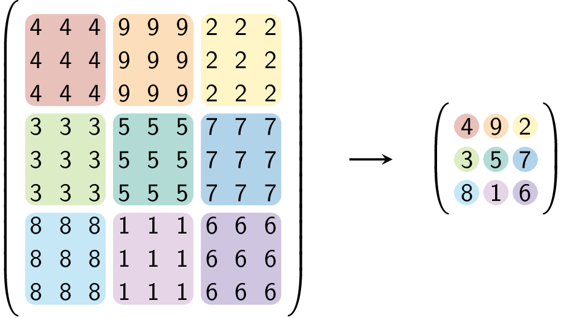
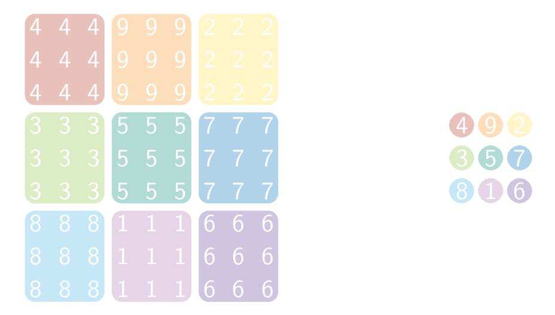

Je kan een homothetische matrix ook terug gaan inkrimpen. Onderstaande kan je terug inkrimpen met factor 3.

{:data-caption=Homothetie met factor 3." .light-only height="280px"}

{:data-caption=Homothetie met factor 3." .dark-only height="280px"}

## Gevraagd
Om deze oefening op te lossen schrijf je **twee functies**.

Schrijf eerst een functie `bepaal_factor(matrix)` die gegeven een matrix op zoek gaat naar de factor (`k` ⩾ 1) waarmee de matrix vergroot werd. Je retourneert dus het gehele getal `k`. Je mag ervan uit gaan dat de oorspronkelijke matrix uit verschillende gehele getallen werd opgebouwd, er zijn dus geen gelijke 'blokken' zijn.

Schrijf een functie `inkrimpen(matrix)` die de homothetische matrix gaat inkrimpen. Maak in deze functie gebruik van de vorige functie.

Bestudeer grondig onderstaande voorbeelden.

#### Voorbeeld 1

```python
>>> bepaal_factor([[4, 4, 4, 9, 9, 9, 2, 2, 2],
                   [4, 4, 4, 9, 9, 9, 2, 2, 2],
                   [4, 4, 4, 9, 9, 9, 2, 2, 2],
                   [3, 3, 3, 5, 5, 5, 7, 7, 7],
                   [3, 3, 3, 5, 5, 5, 7, 7, 7],
                   [3, 3, 3, 5, 5, 5, 7, 7, 7],
                   [8, 8, 8, 1, 1, 1, 6, 6, 6],
                   [8, 8, 8, 1, 1, 1, 6, 6, 6],
                   [8, 8, 8, 1, 1, 1, 6, 6, 6]])
3
```

```python
>>> inkrimpen([[4, 4, 4, 9, 9, 9, 2, 2, 2],
               [4, 4, 4, 9, 9, 9, 2, 2, 2],
               [4, 4, 4, 9, 9, 9, 2, 2, 2],
               [3, 3, 3, 5, 5, 5, 7, 7, 7],
               [3, 3, 3, 5, 5, 5, 7, 7, 7],
               [3, 3, 3, 5, 5, 5, 7, 7, 7],
               [8, 8, 8, 1, 1, 1, 6, 6, 6],
               [8, 8, 8, 1, 1, 1, 6, 6, 6],
               [8, 8, 8, 1, 1, 1, 6, 6, 6]])
[[4, 9, 2],
 [3, 5, 7],
 [8, 1, 6]]
```

#### Voorbeeld 2

```python
>>> bepaal_factor([[4, 9, 2],
                   [3, 5, 7],
                   [8, 1, 6]])
1
```

```python
>>> inkrimpen([[4, 9, 2],
               [3, 5, 7],
               [8, 1, 6]])
[[4, 9, 2],
 [3, 5, 7],
 [8, 1, 6]]
```

