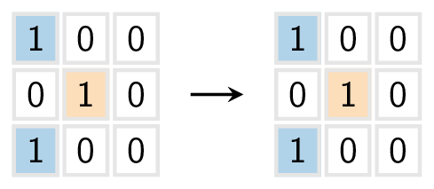
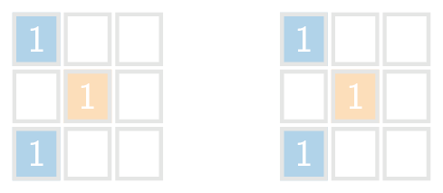
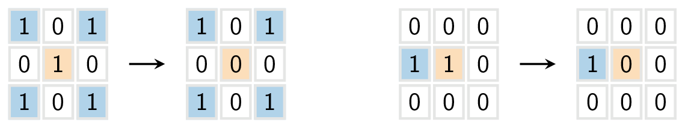
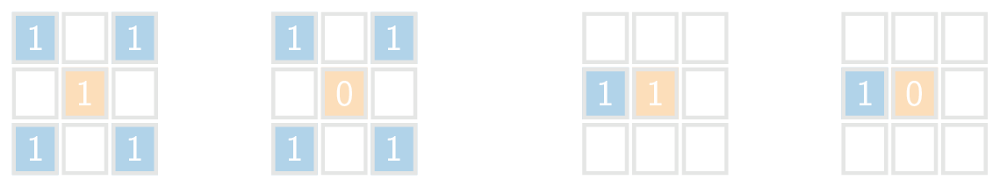
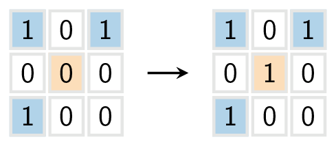
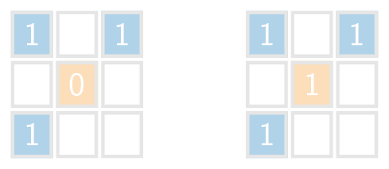
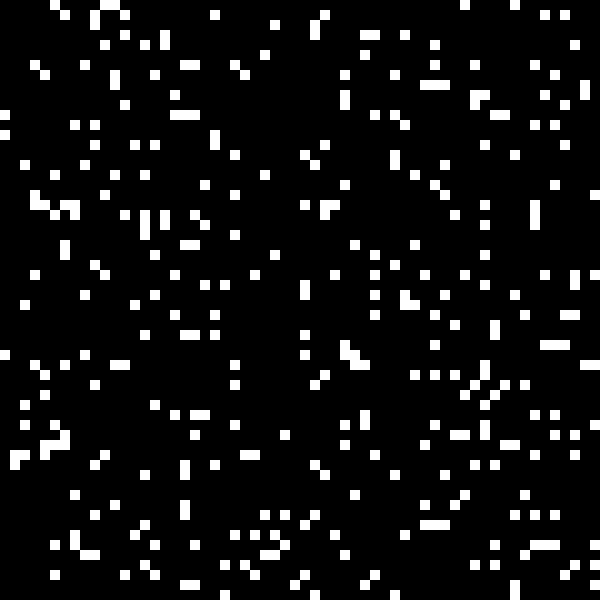

Game of Life is een verzameling van regels die in 1970 door de Britse wiskundige John Conway bedacht zijn en leiden tot allerlei (bewegende) patronen.

Dit wordt 'gespeeld' op een tweedimensionaal rooster, met vierkante cellen die 'levend' `1` of 'dood' `0` kunnen zijn. De regels zijn als volgt:

- Als een cel door 2 of 3 levende buurcellen omgeven wordt, blijft deze cel zelf ook levend, zoals in het voorbeeld hieronder.

{:data-caption=Regel 1" .light-only height="110px"}

{:data-caption=Regel 1" .dark-only height="110px"}

- Als een cel door 4 of meer levende buurcellen omgeven wordt, dan is er sprake van *overbevolking* en *sterft* de cel. Zijn er minder dan 2 levende buurcellen dan sterft de cel ook door *eenzaamheid*.

{:data-caption=Regel 2" .light-only height="110px"}

{:data-caption=Regel 2" .dark-only height="110px"}

- Als een dode cel wordt omgeven door **exact 3** levende buurcellen, wordt er een cel *geboren*.

{:data-caption=Regel 3" .light-only height="110px"}

{:data-caption=Regel 3" .dark-only height="110px"}

Als je dit proces uitvoert, vertrekkende van een bepaalde startsituatie dan kunnen er zich interessante patronen ontwikkelen.

{:data-caption=Een Game of Life simulatie." .light-only height="250px"}

{:data-caption=Een Game of Life simulatie." .dark-only height="250px"}

## Gevraagd
Om deze oefening op te lossen schrijf je **twee functies**.

* Schrijf eerst een functie `aantal_levend(rooster, r, c)` dat in een `rooster` het aantal levende buren bepaalt van een gegeven cel op rij `r` en kolom `c`.

* Schrijf een functie `game(rooster)` die gegeven een rooster een nieuw rooster bepaalt, waarbij elke cel werd aangepast conform de drie regels. Gebruik hierbij de vorige functie `aantal_levend(rooster, r, c)`. 

Bestudeer grondig onderstaande voorbeelden.

#### Voorbeeld 1

```python
>>> aantal_levend([[0, 0, 1, 0],
                   [1, 1, 1, 0],
                   [0, 1, 0, 0]], 1, 1)
4
```

```python
>>> game([[0, 0, 1, 0],
          [1, 1, 1, 0],
          [0, 1, 0, 0]])
[[0, 0, 1, 0],
 [1, 0, 1, 0],
 [1, 1, 1, 0]]
```
