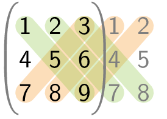
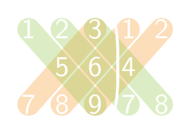

Bij een 3 × 3 matrix kan men de determinant berekenen met behulp van de regel van Sarrus.

{:data-caption=De regel van Sarrus." .light-only height="110px"}

{:data-caption="De regel van Sarrus." .dark-only height="110px"}

Voor een matrix A van de vorm:

$$
\sf A = \begin{pmatrix}
\sf a_{11} & \sf a_{12} & \sf a_{13}\\ 
\sf a_{21} & \sf a_{22} & \sf a_{23}\\
\sf a_{31} & \sf a_{32} & \sf a_{33}
\end{pmatrix} 
$$

gebruikt men de regel van Sarrus door de eerste twee kolommen rechts aan de matrix toe te voegen, en nadien berekent met de producten van de hoofd- en nevendiagonalen. Dit resulteert in:

$$\mathsf{A = a_{11}a_{22}a_{33} +  a_{12}a_{23}a_{31} +a_{13}a_{21}a_{32} - a_{31}a_{22}a_{13} - a_{32}a_{23}a_{11} - a_{33}a_{21}a_{12}}$$

## Gevraagd

Schrijf een functie `sarrus(matrix)` die de determinant berekent met behulp van deze regel.

#### Voorbeeld

```python
>>> sarrus([[1, 2, 3],
            [4, 5, 6],
            [7, 8, 9]])
0
```
Want $$\mathsf{1\cdot 5 \cdot 9 + 2\cdot 6 \cdot 7 + 3\cdot 4 \cdot 8 - 7\cdot 5 \cdot 3 -8\cdot 6\cdot 1 - 9 \cdot 4 \cdot 2 = 0 }$$
