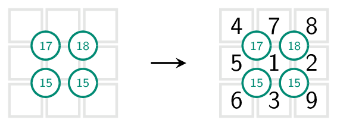
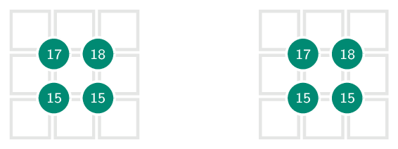

Sujiko is een logische puzzel voor het plaatsen van getallen, bedacht door Jai Gomer. 

Het doel is de getallen van 1 tot en met 9 in een vakje te plaatsen zodat de som van elk vierkant gelijk is aan de bovenliggende waarden.

{:data-caption=Een Sojiko puzzel." .light-only height="110px"}

{:data-caption="Een Sojiko puzzel." .dark-only height="110px"}

Hier geldt bijvoorbeeld dat $$\mathsf{4+7+5+1 = 17}$$, $$\mathsf{7+8+1+2 = 18}$$, $$\mathsf{5+1+6+3 = 15}$$ en $$\mathsf{1+2+3+9 = 15}$$.

## Gevraagd
Schrijf een functie `sujiko(rooster, controle)` die gegeven een ingevuld `rooster` controleert met het bovenliggende controlerooster. Het rooster `controle` heeft dus steeds één kolom en één rij minder dan het ingevulde rooster.

Bestudeer grondig onderstaande voorbeelden.

#### Voorbeelden

```python
>>> sujiko([[4, 7, 8],
            [5, 1, 2],
            [6, 3, 9]],
           [[17, 18],
            [15, 15]])
True
```


```python
>>> sujiko([[4, 1, 8],
            [5, 7, 2],
            [6, 3, 9]],
           [[17, 18],
            [15, 15]])
False
```
Want onderaan rechts geldt $$\mathsf{5 + 7 + 3 + 6 \not = 15}$$.