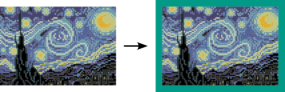
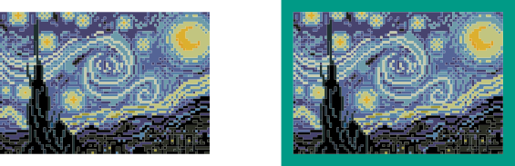

Bij fotobewerking kan je vaak een kader laten toevoegen aan een afbeelding.

{:data-caption="Een kader toevoegen aan een afbeelding." .light-only width="565px"}

{:data-caption="Een kader toevoegen aan een afbeelding." .dark-only width="565px"}

## Gevraagd
Schrijf een functie `kader(rooster, breedte)` die gegeven een rooster een kader toevoegt van `breedte` breed. Dat kader is opgevulgd met het getal `128`.

Bestudeer grondig onderstaand voorbeeld.

#### Voorbeeld

```python
>>> kader([[211, 101,  11],
           [ 64,  11, 121],
           [117, 215, 251]], 2)
[[128, 128, 128, 128, 128, 128, 128],
 [128, 128, 128, 128, 128, 128, 128],
 [128, 128, 211, 101,  11, 128, 128],
 [128, 128,  64,  11, 121, 128, 128],
 [128, 128, 117, 215, 251, 128, 128],
 [128, 128, 128, 128, 128, 128, 128],
 [128, 128, 128, 128, 128, 128, 128]]
```

Er werd een rand van dikte `2` toevoegd rondomrond het rooster (de afbeelding).