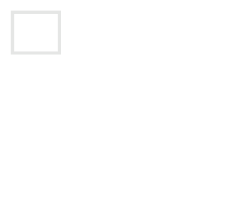

De driehoek van Catalan, vernoemd naar de Belgische wiskundige Eugène Charles Catalan, is een driehoek, gelijkaardig aan die van Pascal. 

Deze driehoek wordt als volgt opgebouwd:

- het eerste element is steeds 1;
- het laatste element van elke rij is steeds gelijk aan het vorige element;
- elk ander element is de som van het linker- en bovenstaande element.


Hieronder vind je een voorbeeld van rang 4.

{:data-caption=De driehoek van Catalan." .light-only width="250px"}

{:data-caption=De driehoek van Catalan." .dark-only width="250px"}

## Gevraagd
Schrijf een functie `driehoek(zijde)` die gegeven de horizontale (of verticale) zijde van de driehoek een twee-dimensionale lijst maakt met de getallen uit de driehoek van Catalan. 

Bestudeer grondig onderstaand voorbeeld.

#### Voorbeeld

```python
>>> driehoek(5)
[[ 1],
 [ 1,  1],
 [ 1,  2,  2],
 [ 1,  3,  5,  5],
 [ 1,  4,  9, 14, 14]]
```
