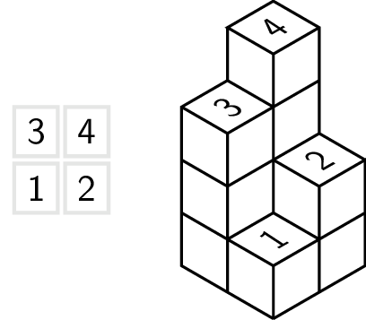

Een stapeling van blokken met zijde 1 kan in een rooster weergegeven worden. Elke waarde in het rooster stelt hierbij een toren, opgebouwd uit evenveel blokjes voor.

Zo zie je dat dit rooster nevenstaande stapeling voorstelt.

{:data-caption=Een blokkentoren." .light-only height="200px"}

{:data-caption=Een blokkentoren." .dark-only height="200px"}

Als de blokken aan elkaar worden gelijmd, wat is dan de totale oppervlakte van de zichtbare vlakken? Het grondvlak telt hierbij mee.

## Gevraagd
Schrijf een functie `oppervlakte(blokken)` die gegeven een rooster met hoogtes van de verschillende torens, de totale oppervlakte van de constructie bepaalt.

Bestudeer grondig onderstaande voorbeelden.

#### Voorbeeld

```python
>>> oppervlakte([[3, 4],
                 [1, 2]])
34
```
