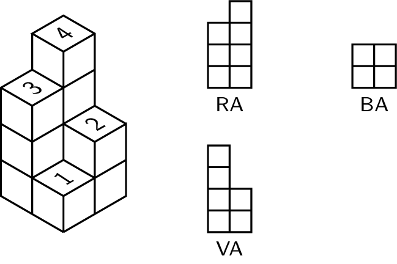
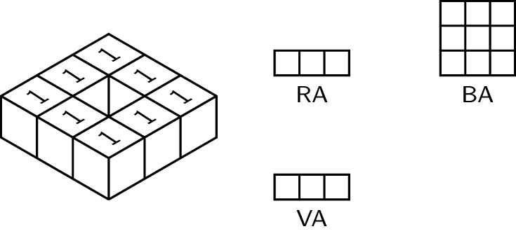

Een stapeling van blokken met zijde 1 kan in een rooster weergegeven worden. Elke waarde in het rooster stelt hierbij een toren, opgebouwd uit evenveel blokjes voor. Van deze stapeling kan je het vooraanzicht (VA), rechterzijaanzicht (RA) en bovenaanzicht (BA) bepalen.

{:data-caption=Een blokkentoren." .light-only height="250px"}

{:data-caption=Een blokkentoren." .dark-only height="250px"}

Wat is de totale oppervlakte van al deze aanzichten?

## Gevraagd
Schrijf een functie `oppervlakte_aanzicht(blokken)` die gegeven een rooster met hoogtes van de verschillende torens, de totale oppervlakte het vooraanzicht, rechterzijaanzicht en bovenaanzicht bepaalt.

Bestudeer grondig onderstaande voorbeelden.

#### Voorbeelden

```python
>>> oppervlakte_aanzicht([[3, 4],
                          [1, 2]])
17
```


```python
>>> oppervlakte_aanzicht([[1, 1, 1],
                          [1, 0, 1],
                          [1, 1, 1]])
14
```

Dit stelt deze constructie voor:

{:data-caption=Een blokkentoren." .light-only height="200px"}

{:data-caption=Een blokkentoren." .dark-only height="200px"}
