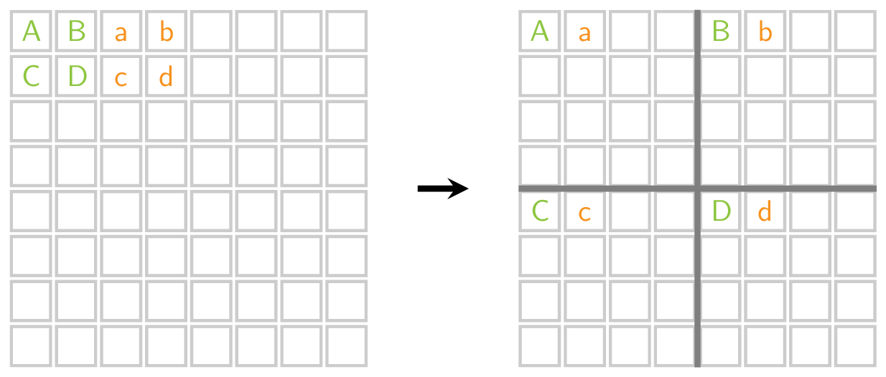
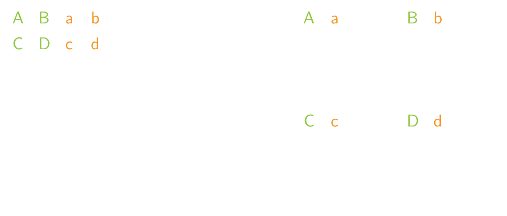

Heb je ooit al de **Photobooth filter** gebruikt op je smartphone? 

Deze filter zal een afbeelding splitsen in 4 identieke maar kleinere afbeeldingen. Hierbij wordt de afbeelding opgesplitst in 2 × 2 vierkanten. De pixels van deze vierkanten worden vervolgens op nieuwe locaties gezet in de 4 kleinere afbeeldingen.

Hieronder zie je het proces werkt bij een 8 × 8 afbeelding. De pixel `D` op positie `[1][1]` wordt verplaatst naar positie `[4][4]`.

{:data-caption=De Photobooth filter." .light-only height="230px"}

{:data-caption=De Photobooth filter." .dark-only height="230px"}

De nieuwe posities van elke pixel worden berekend op de volgende manier:

- als `i` en `j` even zijn, komt `[i][j]` terecht op **plaats** `[i // 2][j // 2]`;
- als `i` even is en `j` oneven is, komt `[i][j]` terecht op **plaats** `[i // 2][(n + j) // 2]`;
- als `i` oneven is en `j` even is, komt `[i][j]` terecht op **plaats** `[(n + i) // 2][j // 2]`;
- als `i` en `j` oneven zijn, komt `[i][j]` terecht op **plaats** `[(n + i) // 2][(n + j) // 2]`.

Hierbij stelt `n` de lengte (en breedte) van de vierkante afbeeldingen voor. Indien je deze filter meerdere keren na elkaar toepast wordt deze eerst meer en meer wazig, maar na een aantal keer wordt dit terug de originele afbeelding!

{:data-caption=De Photobooth filter in actie."  width="200px"}

## Gevraagd

Voor deze oefening schrijf je twee functies:

- Schrijf een functie `photobooth(rooster)` dat gegeven een (vierkant) rooster bovenstaande transformatie éénmaal uitvoert en het resultaat retourneert.
- Schrijf nadien een functie `photobooth_herhaald(rooster, k)` dat de transformatie `k` keer uitvoert en het resultaat retourneert.

Bestudeer grondig onderstaande voorbeelden.

#### Voorbeelden

```python
>>> photobooth([[ 1,  2,  3,  4],
                [ 5,  6,  7,  8],
                [ 9, 10, 11, 12],
                [13, 14, 15, 16]])
[[ 1,  3,  2,  4],
 [ 9, 11, 10, 12],
 [ 5,  7,  6,  8],
 [13, 15, 14, 16]]
```

```python
>>> photobooth_herhaald([[ 1,  2,  3,  4],
                         [ 5,  6,  7,  8],
                         [ 9, 10, 11, 12],
                         [13, 14, 15, 16]], 2)
[[ 1,  2,  3,  4],
 [ 5,  6,  7,  8],
 [ 9, 10, 11, 12],
 [13, 14, 15, 16]]
```
