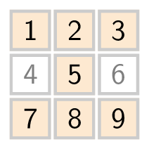
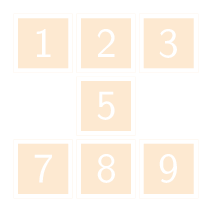

Men definieert een zandlopervorm in een rooster als volgt:

{:data-caption=Zandlopervorm in een 3 × 3 matrix." .light-only height="150px"}

{:data-caption=Zandlopervorm in een 3 × 3 matrix." .dark-only height="150px"}

Gegeven een m × n rooster, zoek dan de zandlopervorm met de grootste som.

## Gevraagd

Schrijf een functie `zandloper(rooster)` dat gegeven een m × n de grootste som van alle zandlopervormen bepaalt.

Bestudeer grondig onderstaande voorbeelden.

#### Voorbeelden

```python
>>> zandloper([[ 1, 2, 3],
               [ 4, 5, 6],
               [ 7, 8, 9]])
35
```
Dit rooster bevat immers maar één zandlopervorm, met als som 1 + 2 + 3 + 5 + 7 + 8 + 9.   


```python
>>> zandloper([[ 6, 2, 1, 3],
               [ 4, 2, 1, 5],
               [ 9, 2, 8, 7],
               [ 4, 1, 2, 9]])
30
```

