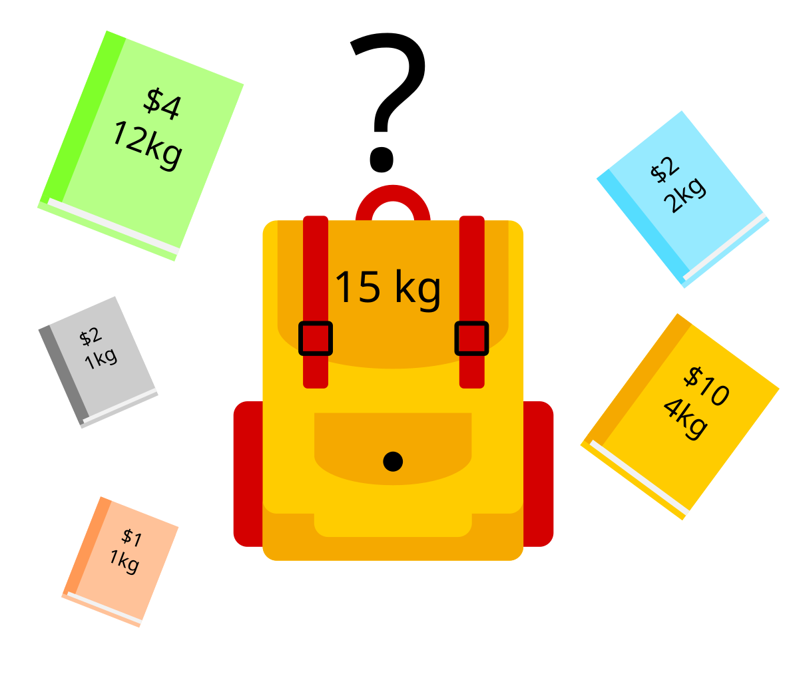

Een gekend probleem uit de informaticawetenschappen is het zogenaamde <a href="https://nl.wikipedia.org/wiki/Knapzakprobleem" target="_blank">knapsack</a> (rugzak) probleem. 

Gegeven een rugzak die een maximale massa kan vervoeren en een lijst met boeken van verschillende massas en hun kostprijs. Bepaal dan welke boeken men kan meenemen zodat de kostprijs maximaal is.

{:data-caption="Afbeelding door VectorVoyager op Wikimedia." width="35%"}

In dit voorbeeld kan drie gele boeken en drie grijze boeken meenemen. In dat geval zit de rugzak volledig vol (15 kg) en bedraagt de kostprijs 3 · $10 + 3 · $2 = $36. Dit is de grootste kostprijs die men mee kan nemen.

## Gevraagd
Schrijf een functie `knapsack(maximale_massa, lijst)` die gegeven een maximale massa en een lijst met tupels van massas en kostprijzen de optimale combinaties zoekt. Probeer het totale aantal boeken te beperken.

De lijst met de massas en kostprijzen staat zodanig gerangschikt volgens gemiddelde kostprijs (van hoog naar laag). Bij identieke gemiddelde kostprijs staan de hoogste massas eerst. 

#### Voorbeeld

```python
>>> knapsack(15, [(4,10), (1, 2), (2, 2), (1, 1), (12, 4)])
{(4, 10): 3, 
 (1, 2): 3}
```

```python
>>> knapsack(4, [(3,5), (2,3)])
{(3, 5): 1}
```