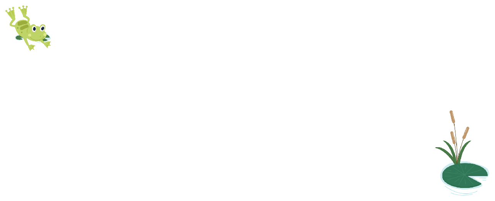

Een kikker springt in onderstaand roosters telkens naar het vakje rechts, of naar het vakje eronder. Welke route geeft de kleinste som?

{:data-caption="Geïnspireerd op een oefening uit Matrix 1." .light-only width="60%"}

{:data-caption="Geïnspireerd op een oefening uit Matrix 1." .dark-only width="60%"}

De kikker begint steeds op het vakje links boven en moet eindigen op het vakje rechts onderaan.

## Gevraagd
Schrijf een functie `kleinste_pad(tabel)` die gegeven een matrix met gehele getallen de som bepaalt van het kleinste pad met behulp van **een gretig algoritme**. Indien je alle opties overloopt zal dit hoogst waarschijnlijk niet het kleinste pad zijn, maar slechts een benadering.

#### Voorbeeld

```python
>>> kleinste_pad([[ -3,  7, -3, -6, -5, -4, -10], 
                  [  2, 10,  5, -4,  9,  1,  -9], 
                  [-10,  3, -4,  0, -6,  6,   4], 
                  [-10, 10, -1, -7, -7, -5,  -7]])
-38
```
Hierbij neemt de kikker de route volledig tot de onderste rij, waarna deze naar rechts beweegt.

{: .callout.callout-info}
>#### Merk op
> Dit is niet de het *kleinste* pad. Er kan namelijk een pad gevonden worden met een *niet iets kleinere som*. Vind je dit betere pad?