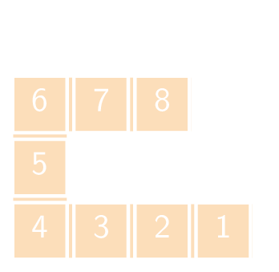

Om het absolute minimum uit een rooster te halen dient men **elk** element te overlopen. Misschien kan het korter door een klein element in de buurt van een willekeurig startelement te zoeken.

Indien men in onderstaand rooster begint vanaf een willekeurig element, bijvoorbeeld rij 1 en kolom 2, dan kan door telkens op te schuiven naar het kleinste element uiteindelijk op het element rechtsonder belanden. Dit getal beandert het echte minimum.

{:data-caption="Een minimum gretig opzoeken." .light-only height="110px"}

{:data-caption="Een minimum gretig opzoeken." .dark-only height="110px"}


## Gevraagd
Schrijf een functie `lokaal_minimum(rooster, start)` die gegeven een 2D-rooster met verschillende getallen `rooster` op zoek gaat naar een minimum in de buurt van de tupel `start` die de startcoördinaat voorstelt. De functie retourneert het (benaderende) minimum.

Bestudeer onderstaande voorbeelden grondig.

#### Voorbeelden

```python
>>> lokaal_minimum([[15, 13, 12,  0],
                    [ 6,  7,  8, 10],
                    [ 5, 11,  9,  4],
                    [ 4,  3,  2,  1]], (1, 2))
1
```


```python
>>> lokaal_minimum([[15, 13, 12,  0],
                    [ 6,  7,  8, 10],
                    [ 5, 11,  9,  4],
                    [ 4,  3,  2,  1]], (0, 2))
0
```
