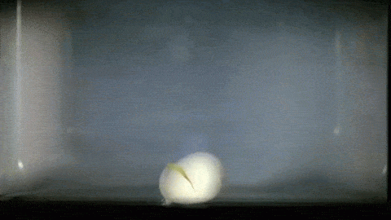

Eieren koken in de microgolfoven, dat is niet evident. De microgolven zorgen ervoor dat het water binnen het ei snel gaat koken en omgezet wordt naar stoom, waarna de eischaal deze uitzetting niet aan kan en het ei ontploft.

{:data-caption="Eieren in een microgolfoven, niet evident!" width="300px"}

Er werden speciale speciale kommen ontwikkeld zodat je een ei wel kan koken in de microgolf. Deze kommen kunnen een bepaalde hoeveelheid eieren bevatten en een maximale massa. Indien je drie eieren hebt, met massas van 50 g, 60 g en 80 g, en de kom kan maximaal 2 eieren bevatten zodat de maximale massa kleiner is dan 120 g, dan kan je de eerste twee eieren klaarkoken in de microgolf.

## Gevraagd
Programmeer een functie `eieren_koken(max_aantal, max_massa, eieren)` die gegeven het maximale aantal eieren `max_aantal` dat de kom kan bevatten, de maximale massa `max_massa` die de kom kan dragen en de massas van de aparte eieren `eieren` (gesorteerd van klein naar groot), bepaal dan het **maximale aantal** eieren dat je klaar kan koken.

Bestudeer onderstaande voorbeelden grondig.
#### Voorbeelden

```python
>>> eieren_koken(2, 120, [50, 60, 80])
2
```

```python
>>> eieren_koken(5, 50, [40, 40, 50, 55])
1
```

```python
>>> eieren_koken(5, 80, [40, 40, 50, 55])
2
```

{: .callout.callout-secondary}
>#### Bron
> Gebaseerd op probleem *Boiled Eggs*, Universiteit van Valladolid (UVa). 
