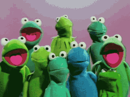

Een koorleider wil met haar koor deelnemen aan een wedstrijd en wil daarvoor de volgende regels gebruiken:

- elk lid van het koor start op een bepaalde toonhoogte;
- na elke maat wijst de koorleider twee leden aan, het ene lid zal exact één toonhoogte hoger zingen, het andere lid zingt één toonhoogte lager;
- het optreden eindigt na de maat waarbij elk koorlid op dezelfde toonhoogte zingt.

{:data-caption="De Muppets, het perfecte koor" width="200px"}

De toonhoogtes worden voorgesteld door gehele getallen. Stel bijvoorbeeld dat het koor uit vier leden bestaat, waarbij ze starten met de toonhoogtes `1`, `3`, `4` en `4`. Als de koorleider na de eerste maat het eerste en het laatste lid vraagt om van toonhoogte te wijzigen, dan zingt het koor op de volgende hoogtes `2`, `3`, `4` en `3`. Na de tweede maat vraagt de koorleider aan het eerste en derde lid om van toonhoogte te veranderen. Zo zingt het koor uiteindelijk op de hoogtes `3`, `3`, `3`, `3`. Na de derde maat zingt elk lid dus op dezelfde toonhoogte en eindigt het optreden.

## Gevraagd
Programmeer een functie `perfecte_koor(toonhoogtes)` die gegeven een lijst met toonhoogtes van de verschillende koorleden op zoek gaat naar het minimum aantal maten tot het koor op dezelfde toonhoogte zingt. De `toonhoogtes` werden reeds gesorteerd van klein naar groot. 

Indien dit **niet mogelijk** is, retourneer dan `-1`.

Bestudeer onderstaande voorbeelden grondig.
#### Voorbeelden

```python
>>> perfecte_koor([1, 3, 4, 4])
3
```

```python
>>> perfecte_koor([1, 2, 3])
2
```

```python
>>> perfecte_koor([10, 10, 10, 10, 10])
1
```

```python
>>> perfecte_koor([3, 6, 9, 12])
-1
```

{: .callout.callout-secondary}
>#### Bron
> Gebaseerd op probleem *Perfect Choir*, Universiteit van Valladolid (UVa). 
