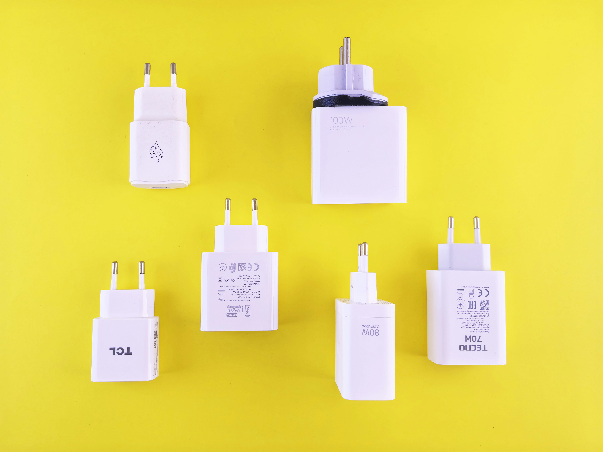

Een bedrijf wil de belasting op de stroomvoorziening beperken. Elk van de apparaten binnen het bedrijf gebruikt een bepaalde hoeveelheid stroom. Men voert de volgende beperking in, als er apparaten van verschillende stroomsterktes gemengd worden, dan werken ze steeds op de laagste stroomsterkte. De stroomsterktes worden aangeduid via een bepaald rangnummer.

Stel dat drie verschillende apparaten met de rangen 3, 5 en 7 tegelijkertijd aangeschakeld worden, dan wijzigt de stroomsterkte naar rang 3 en wordt een stroomsterkte van 3 · 3 = 9 gebruikt. Indien men echter enkel de apparaten met rang 5 en 7 inschakelt, dan wordt een stroomsterkte van 2 · 5 = 10 gebruikt, wat beter is dan de vorige schakeling.

{:data-caption="Foto door Andrey Matveev op Unsplash." width="35%"}

## Gevraagd
Programmeer een functie `maximale_stroom(apparaten)` die gegeven een lijst `apparaten` bestaande uit tupels van de vorm `(rangnummer, aantal)` de maximale stroomsterkte die je kan vormen retourneert. Elke tupel bestaat uit het rangnummer van een apparaat en hoeveel apparaten er aanwezig zijn in het bedrijf. Je mag ervan uitgaan dat de tupels geordend zijn volgens **dalend rangnummer**.

Bestudeer onderstaande voorbeelden grondig.

#### Voorbeelden

```python
>>> maximale_stroom([(7, 1), (5, 1), (3, 1)])
10
```
Als er één toestel van rang 7, van rang 5 en rang 3 is, dan kan je door de eerste twee toestellen aan te schakelen een stroomsterkte van 10 gebruiken.


```python
>>> maximale_stroom([(9, 1), (5, 2), (3, 1)])
15
```
In dit geval is er één toestel van rang 9, twee toestellen van rang 5 en één toestel van rang 3. Door de twee toestellen van rang 5 en het toestel van rang 9 aan te schakelen gebruikt men stroomsterkte van 15. 

```python
>>> maximale_stroom([(10, 6), (4, 1), (3, 3), (1, 4)])
60
```

```python
>>> maximale_stroom([(5, 4), (1, 4)])
20
```


{: .callout.callout-secondary}
>#### Bron
> Gebaseerd op probleem *Geek Power Inc.*, Universiteit van Valladolid (UVa). 
