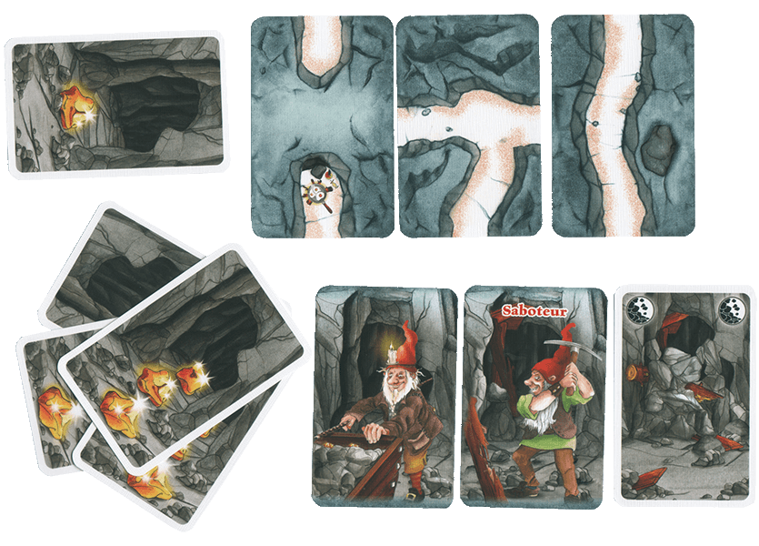

Misschien ken je het kaartspel Saboteur. In dit spel spelen de saboteurs tegen de gewone dwergen, op het einde wordt het aantal goudstukken verdeeld over de winnaars. Na enkele rondjes wint de speler met het meeste aantal goudstukken.

{:data-caption="Saboteur kaarten." width="35%"}

Men kan het aantal goudstukken voorstellen als een lijst, bijvoorbeeld `[2, 1, 1, 2, 3, 2]`. In het spel kiest elke speler op zijn beurt een aantal goudstukken, daarna geeft die de kaarten met de goudstukken door aan de volgende speler.

Stel nu dat er `3` spelers zijn, dan is `[5, 3, 3]` de beste keuze voor elke speler. De eerste speler kiest immers de kaart met 3 goudstukken, de volgende speler een kaart met 2 goudstukken, enz...

## Gevraagd
Programmeer een functie `saboteur(goudstukken, aantal)` die gegeven een lijst met de `goudstukken` en het aantal spelers `aantal` een lijst retourneert met de optimale keuze voor elke speler.

Bestudeer onderstaande voorbeelden grondig.

#### Voorbeelden

```python
>>> saboteur([2, 1, 1, 2, 3, 2], 3)
[5, 4, 2]
```

```python
>>> saboteur([2, 1, 1, 2, 3, 2], 2)
[6, 5]
```

{: .callout.callout-secondary}
>#### Bron
> Geïnspireerd op *Falling Apart*, Benelux Algorithm Programming Contest 2017
