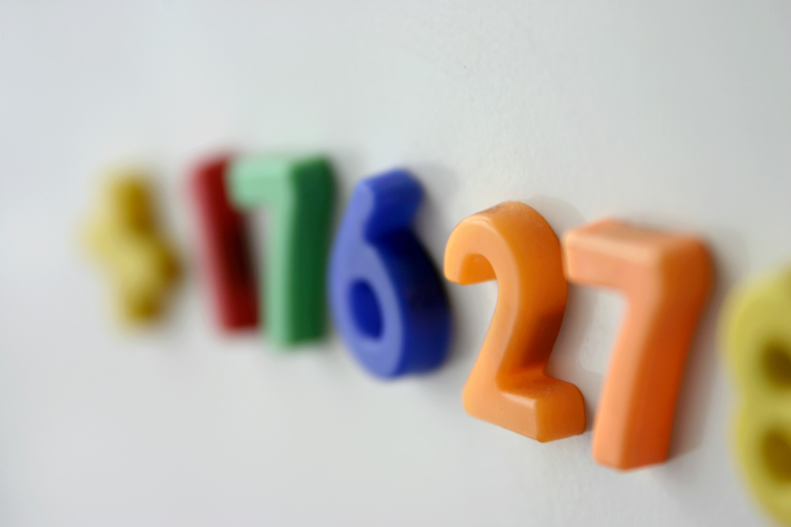

De technologie die een frigo doet werken is sinds zijn uitvinding gelijkaardig gebleven, maar er kwamen in de tijd heel wat nieuwe functies bij. Tegenwoordig heb je zelfs frigo's die weten wat er allemaal in zit.

Wat niet gewijzigd is, is het gebruik van magneten op de frigodeur. Een eenvoudige, maar leerrijke manier, om een kind bezig te houden, is door die van een set magnetische cijfers te voorzien en te vragen om met deze cijfers te tellen, '1', '2', ..., tot '10', '11', enz... 

{:data-caption="Foto door tap78 op FreeImages." width="35%"}

De mogelijkheden zijn schier eindeloos, of dat zouden ze zijn indien je van elk cijfer een oneindig aantal stuks krijgt. Gegeven een lijst met cijfers, wat is kleinste (strikt) positieve getal dat je hier **niet** mee kan vormen?

## Gevraagd
Programmeer een functie `frigo(cijfers)` die gegeven een lijst met cijfers, het kleinste (strikt) positieve getal retourneert dat je met deze cijfers **niet** meer kan vormen. Elk cijfer uit de lijst mag je hoogstens één keer gebruiken.

Bestudeer onderstaande voorbeelden grondig.

#### Voorbeelden

```python
>>> frigo([1, 2, 3, 4, 5, 6, 7, 8, 9])
10
```

```python
>>> frigo([5, 5])
1
```

```python
>>> frigo([7, 1, 2, 9, 0, 4, 5, 8, 6, 3])
11
```

{: .callout.callout-secondary}
>#### Bron
> United Kingdom and Ireland Programming Contest 2016
