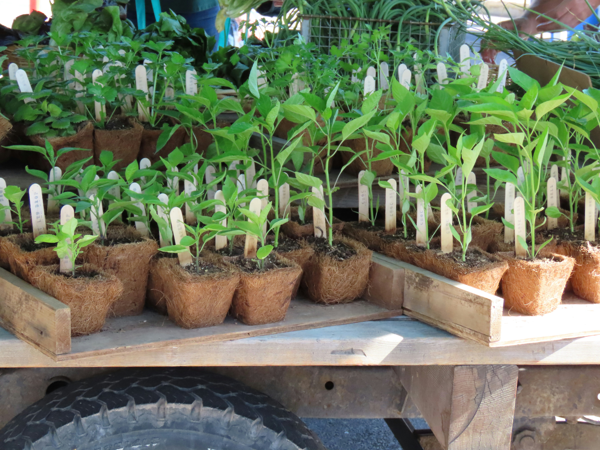

Boer Jon heeft recent een aantal zaailingen gekocht die hij wil planten, hij is echter liever lui dan moe en plant elke dag slechts één enkele zaailing. Hij weet voor elke zaailing hoeveel dagen het duurt eer deze helemaal volgroeid is. Indien hij vandaag een zaailing pant die na vijf dagen volgroeid is, dan zal op dag 6 de plant helemaal volgroeid zijn.

Jon wil een feest houden voor zijn vrienden, maar om indruk te maken wil hij wachten tot na alle planten volledig volgroeid zijn. Nog exacter uitgedrukt kan Jon het feest maar organiseren de dag nadat alle planten volgroeid zijn.

{:data-caption="Foto door Judy Beth Morris op Unsplash." width="35%"}

Help Jon door de vroegste dag te vinden waarop het feest kan doorgaan. Jon mag zelf kiezen in welke volgorde hij de zaailingen plant. Hij kiest dus een optimale volgorde zodat het feest zo snel mogelijk door kan gaan.

## Gevraagd
Programmeer een functie `optimale_beplanting(zaailingen)` die gegeven een lijst met dagen waarop de zaailingen volgroeid zijn de vroegste dag retourneert waarom Jon zijn feest kan houden.

Bestudeer onderstaande voorbeelden grondig.

#### Voorbeelden

```python
>>> optimale_beplanting([2, 3, 4, 3])
7
```

Door de zaailingen in de juiste volgorde te planten kan Jon na 7 dagen het feest organiseren.


```python
>>> optimale_beplanting([39, 38, 9, 35, 39, 20])
42
```

Bij deze zaailingen lukt het ten vroegste pas na 42 dagen om het feest te organiseren.

{: .callout.callout-secondary}
>#### Bron
> Gebaseerd op *Planting Trees*, Nordic Collegiate Programming Contest 2013
