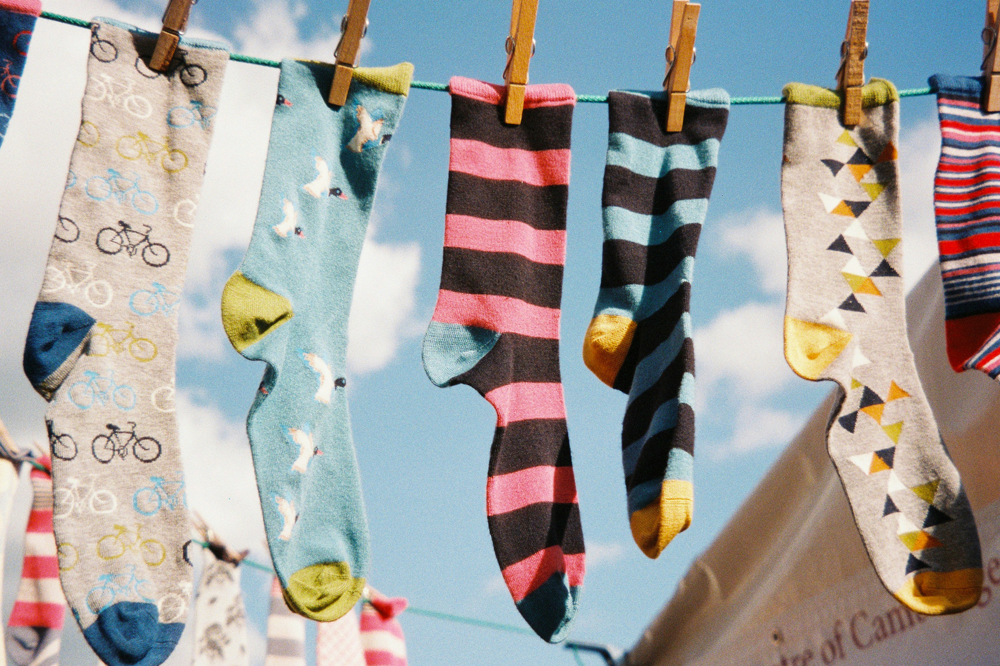

Misschien heb je thuis ook sokken die oorspronkelijke wit waren, maar na enkele wasbeurten een beige tint kregen... Lukas ondervond hetzelfde probleem.

Hij wil dit voorkomen door verschillende kleuren aparte te wassen. Omdat hij echter te lui is om de was in meerdere beurten te doen, zal hij meerdere wasmachines kopen.

{:data-caption="Foto door Nick Page op Unsplash." width="35%"}

Lukas geeft elk van zijn sokken een bepaalde kleurcode $$\mathsf{k_i}$$ tussen 0 en 10⁹, na wat experimenteren vond hij dat hij sokken samen kan wassen indien het maximale absolute kleurverschil kleiner is dan een bepaald getal $$\mathsf{v}$$. Het kleurverschil tussen twee sokken i en j kan je uitdrukken via 
$$\mathsf{\mid k_i - k_j\mid}$$.

Lukas wil weten hoeveel wasmachines hij minimaal nodig heeft, indien elke machine hoogstens `n` sokken kan wassen.

## Gevraagd
Smurf een functie `aantal_machines(n, v, kousen)` die gegeven het maximaal aantal sokken per machine `n`, het maximale absolute kleurverschil `v` en een lijst met alle kleurcodes van de kousen `kousen` het minimale aantal wasmachines bepaalt.

Bestudeer onderstaande voorbeelden grondig.

#### Voorbeelden

```python
>>> aantal_machines(3, 0, [0, 2, 1, 1, 0])
3
```

Elke kleur (`0`, `1` en `2`) moet hier apart, vandaar er 3 machines nodig zijn.


```python
>>> aantal_machines(3, 1, [0, 2, 1, 1, 0])
2
```

Je kan hier bijvoorbeeld de kleuren `0`, `1` en `0` in de eerste wasmachine steken en `2` en `1` in de tweede wasmachine.

{: .callout.callout-secondary}
>#### Bron
> KTH Training
