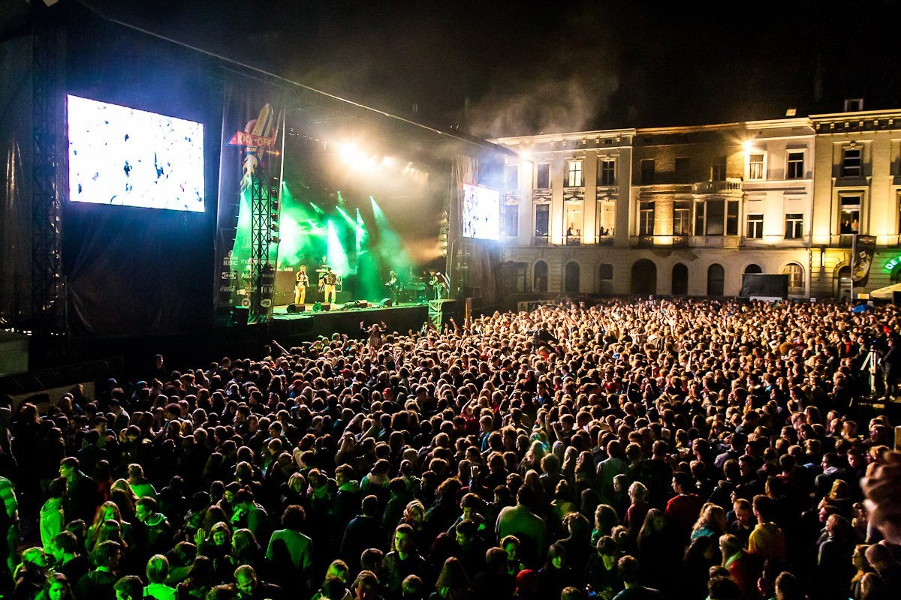

IJverige student Bruno, met een studentenkot op het Sint-Pietersplein, wil zijn studiewerk inplannen. Het Student Kick-Off festival gaat echter door en hij kan zich niet concentreren als er achtergrondlawaai is. 

{:data-caption="Student Kick-Off door Studio 100." width="35%"}

Gelukkig zijn de organisatoren zeer precies en ze voorzien alle omwonenden van de tijdsintervallen waarop er muziek zal spelen. Deze intervallen werden tot op de milliseconde getimed.

Elke taak die Bruno uitvoert moet vervolledigt worden binnen een stil interval, hij kan een taak dus niet pauzeren als er muziek begint te spelen. Bruno wil ook wat ontspannen en pauzeert na elke taak om te genieten van het volgende muzikale intermezzo. Hij werkt dus **maximaal één taak** af per interval.

## Gevraagd
Programmeer een functie `maximale_taken(studiewerk, stiltetijden)` die gegeven een lijst met de tijden die Bruno nodig heeft voor zijn `studiewerk` en een lijst met de lengtes van de intervallen `stiltetijden` waarbij er **geen muziek** speelt op zoek gaat naar het maximale aantal taken dat Bruno kan afwerken.

Bestudeer onderstaande voorbeelden grondig.

#### Voorbeelden

```python
>>> maximale_taken([150000, 100000, 160000, 100000, 180000], 
                   [190000, 170000, 140000, 160000])
4
```

```python
>>> maximale_taken([180000, 185000, 199999, 100000], 
                   [199999, 180000, 170000, 120000])
3
```

```python
>>> maximale_taken([199999, 180000, 170001], 
                   [199999, 170000, 180000])
2
```

{: .callout.callout-secondary}
>#### Bron
> Rocky Mountain Regional Contest 2017
