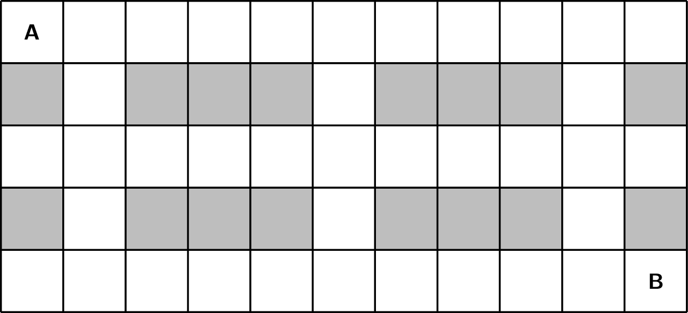
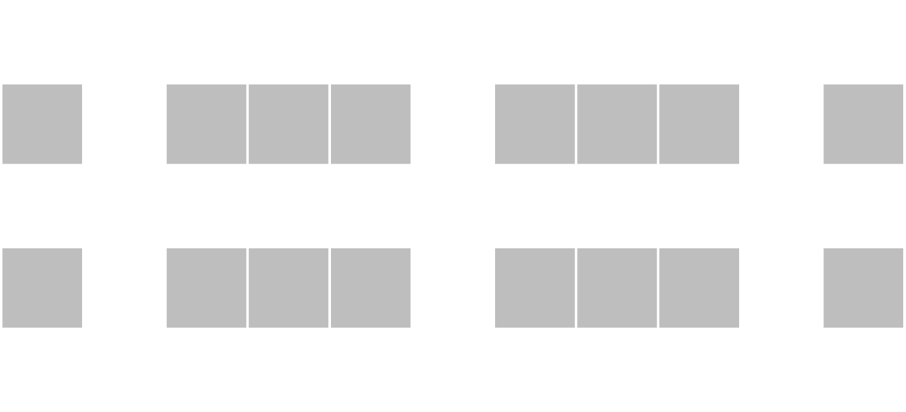

Gegeven is een rooster waarbij je van het aantal wegen in een rooster moet tellen van linksboven naar rechtsonder. Je mag hierbij enkel naar rechts en naar onder bewegen. De grijze blokjes stellen obstakels voor.

{:data-caption="Aantal wegen in een rooster." .light-only width="60%"}

{:data-caption="Aantal wegen in een rooster." .dark-only width="60%"}

Dergelijk rooster wordt voorgesteld met behulp van een twee-dimensionale lijst bestaande uit de getallen `0` of `1`. Een `1` stelt een obstakel voor.

## Gevraagd
Schrijf een functie `aantal_wegen(rooster)` die gegeven een rooster het totale aantal wegen van links boven naar rechtsonder bepaalt. Gebruik hiervoor een dynamisch algoritme.

#### Voorbeelden

```python
>>> aantal_wegen([[0, 0, 0, 0, 0, 0, 0, 0, 0, 0, 0], 
                  [1, 0, 1, 1, 1, 0, 1, 1, 1, 0, 1], 
                  [0, 0, 0, 0, 0, 0, 0, 0, 0, 0, 0], 
                  [1, 0, 1, 1, 1, 0, 1, 1, 1, 0, 1],
                  [0, 0, 0, 0, 0, 0, 0, 0, 0, 0, 0]])
6
```

```python
>>> aantal_wegen([[0, 0, 0, 0, 0, 0, 0, 0, 0, 0, 0], 
                  [1, 0, 1, 0, 1, 0, 1, 1, 1, 0, 1], 
                  [0, 0, 0, 0, 0, 0, 0, 0, 0, 0, 0], 
                  [1, 0, 1, 1, 1, 0, 1, 0, 1, 0, 1],
                  [0, 0, 0, 0, 0, 0, 0, 0, 0, 0, 0]])
11
```

{: .callout.callout-secondary}
>#### Bron
> Gebaseerd op vraag 2 uit beOI 2024.
