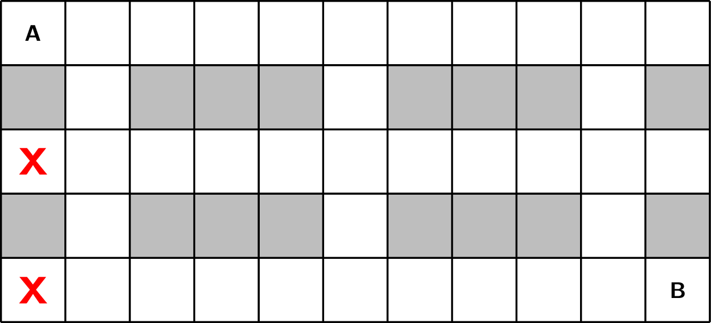
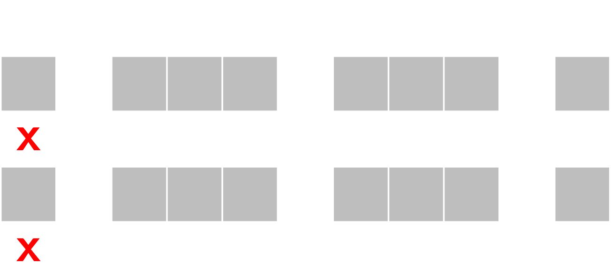

Gegeven is een rooster waarbij je van het aantal wegen in een rooster moet tellen van linksboven naar rechtsonder. Je mag hierbij enkel naar rechts en naar onder bewegen. De grijze blokjes stellen obstakels voor.

Sommige vakjes zijn mogelijks onbereikbaar indien een robot volgens deze regels beweegt. Hoeveel van deze vakjes zijn onbereikbaar?

{:data-caption="Er zijn 2 vakjes onbereikbaar." .light-only width="40%"}

{:data-caption="Er zijn 2 vakjes onbereikbaar." .dark-only width="40%"}

Dergelijk rooster wordt voorgesteld met behulp van een twee-dimensionale lijst bestaande uit de getallen `0` of `1`. Een `1` stelt een obstakel voor.

## Gevraagd
Schrijf een functie `aantal_onbereikbaar(rooster)` die gegeven een rooster het totale aantal onbereikbare vakjes telt. De vakjes waar een obstakel staat tellen niet mee.

#### Voorbeelden

```python
>>> aantal_onbereikbaar([[0, 0, 0, 0, 0, 0, 0, 0, 0, 0, 0], 
                         [1, 0, 1, 1, 1, 0, 1, 1, 1, 0, 1], 
                         [0, 0, 0, 0, 0, 0, 0, 0, 0, 0, 0], 
                         [1, 0, 1, 1, 1, 0, 1, 1, 1, 0, 1],
                         [0, 0, 0, 0, 0, 0, 0, 0, 0, 0, 0]])
2
```

```python
>>> aantal_onbereikbaar([[0, 0, 0, 0, 0, 0, 0, 0, 0, 0, 0], 
                         [1, 1, 1, 0, 1, 0, 1, 1, 1, 0, 1], 
                         [0, 0, 0, 0, 0, 0, 0, 0, 0, 0, 0], 
                         [1, 0, 1, 1, 1, 0, 1, 0, 1, 0, 1],
                         [0, 0, 0, 0, 0, 0, 0, 0, 0, 0, 0]])
9
```

{: .callout.callout-secondary}
>#### Bron
> Gebaseerd op vraag 2 uit beOI 2024.
