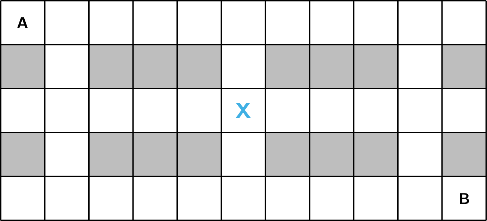
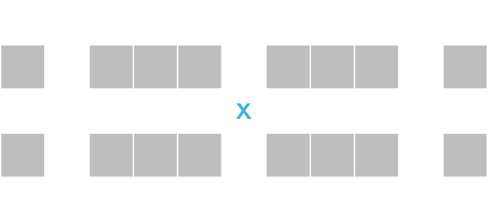

Gegeven is een rooster waarbij je van het aantal wegen in een rooster moet tellen van linksboven naar rechtsonder. Je mag hierbij enkel naar rechts en naar onder bewegen. De grijze blokjes stellen obstakels voor.

Dergelijk rooster wordt voorgesteld met behulp van een twee-dimensionale lijst bestaande uit de getallen `0` of `1`. Een `1` stelt een obstakel voor.

Stel dat je via een bepaald vakje moet bewegen, hoeveel mogelijke wegen zijn er dan van A naar B, via X?

{:data-caption="Er zijn 2 vakjes onbereikbaar." .light-only width="40%"}

{:data-caption="Er zijn 2 vakjes onbereikbaar." .dark-only width="40%"}

## Gevraagd
Schrijf een functie `aantal_via(rooster, coordinaat)` die gegeven een rooster en een coordinaat als een tupel het aantal wegen van A naar B via, die coördinaat telt en retourneert.

#### Voorbeelden

```python
>>> aantal_via([[0, 0, 0, 0, 0, 0, 0, 0, 0, 0, 0], 
                [1, 0, 1, 1, 1, 0, 1, 1, 1, 0, 1], 
                [0, 0, 0, 0, 0, 0, 0, 0, 0, 0, 0], 
                [1, 0, 1, 1, 1, 0, 1, 1, 1, 0, 1],
                [0, 0, 0, 0, 0, 0, 0, 0, 0, 0, 0]], (2,5))
4
```

```python
>>> aantal_via([[0, 0, 0, 0, 0, 0, 0, 0, 0, 0, 0], 
                [1, 1, 1, 0, 1, 0, 1, 1, 1, 0, 1], 
                [0, 0, 0, 0, 0, 0, 0, 0, 0, 0, 0], 
                [1, 0, 1, 1, 1, 0, 1, 0, 1, 0, 1],
                [0, 0, 0, 0, 0, 0, 0, 0, 0, 0, 0]])
9
```

{: .callout.callout-secondary}
>#### Bron
> Gebaseerd op vraag 2 uit beOI 2024.
