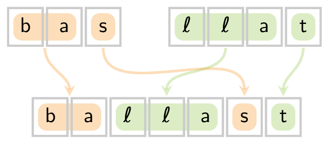
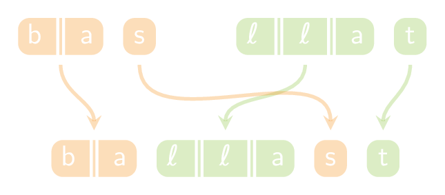

Gegeven zijn twee aparte woorden en een doelwoord. Er wordt gevraagd naar het **aantal mogelijkheden** om het doelwoord te vormen door de aparte stukken uit de twee aparte woorden te ritsen.

Hieronder zie je hoe het woord `"ballast"` gevormd kan worden uit de woorden `"bas"` en `"llat"`.

{:data-caption="Woorden ritsen." .light-only height="120px"}

{:data-caption="Woorden ritsen." .dark-only height="120px"}

Het is hierbij **niet toegestaan** om de volgorde van de letters in de aparte woorden te wijzigen.

## Gevraagd
Schrijf een functie `woorden_ritsen(woord1, woord2, doelwoord)` dat gegeven de twee oorspronkelijke woorden `woord1` en `woord2` het aantal mogelijkheden bepaalt om het `doelwoord` te kunnen vormen.

Je mag ervan uitgaan dat het `doelwoord` evenveel letters bevat als de som van het aantal letters in `woord1` en `woord2`.

#### Voorbeelden

```python
>>> woorden_ritsen("bas", "llat", "ballast")
1
```

```python
>>> woorden_ritsen("bsa", "llat", "ballast")
0
```
