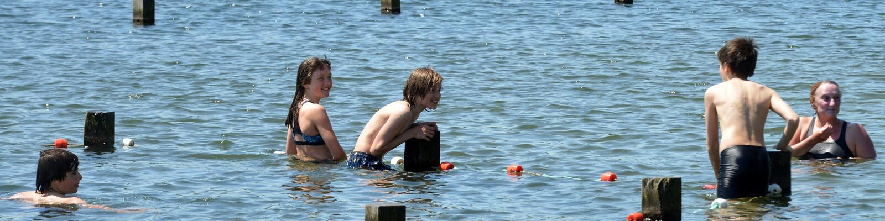

Elke week wordt de waterkwaliteit van de Blaarmeersen gecontroleerd. De resultaten vind je terug op <a href="https://kwaliteitzwemwater.be/nl/blaarmeersen/blaarmeersen-zwemsportzone-gent?page=0">deze website</a>.

{:data-caption="Een foto van de Blaarmeersen door stad Gent." width="65%"}

Bij zwemvijvers controleert men de waterstalen op de aanwezigheid van *intestinale enterokokken* en de *E. coli* bacteriën. Van deze stalen worden via een petrischaal het <a href="https://nl.wikipedia.org/wiki/Kiemgetal" target="_blank">kiemgetal</a> in het aantal kolonievormende eenheden per 100 ml (kve/100 ml) bepaald. Dit kiemgetal wordt weergeven op de bovenstaande website en in onderstaande dataset.

## De waterkwaliteit 'ophalen'

Onderaan vind je de (*lastige*) code om de gegevens uit de website te extraheren. De details van die code zijn niet belangrijk. Een **voorsmaakje** van de dataset via `head(data)` resulteert in:

```
       datum kwaliteit enterococcus e_coli temp
1 2023-09-12 Zeer goed           15     61 23.4
2 2023-09-04 Zeer goed           15     30 21.4
3 2023-08-29 Zeer goed           30     15 19.9
4 2023-08-21 Zeer goed           15     15 22.9
5 2023-08-14 Zeer goed           15     15 23.7
6 2023-08-07 Zeer goed           15     15 19.1
```

## Gegeven

Zoals je merkt bestaat de dataset uit **vijf vectoren**. Gebruik deze om onderstaande vragen te beantwoorden.

## Gevraagd

- De code `data$datum >= "2023-01-01"` leidt tot een **booleaanse vector** met de datums die **op of na 1 januari 2023** kwamen. **Selecteer** de gemeten watertemperaturen en gebruik dit om het aantal metingen uit 2023 op te slaan in de variabele `metingen_2023`.