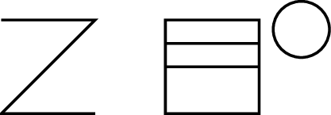
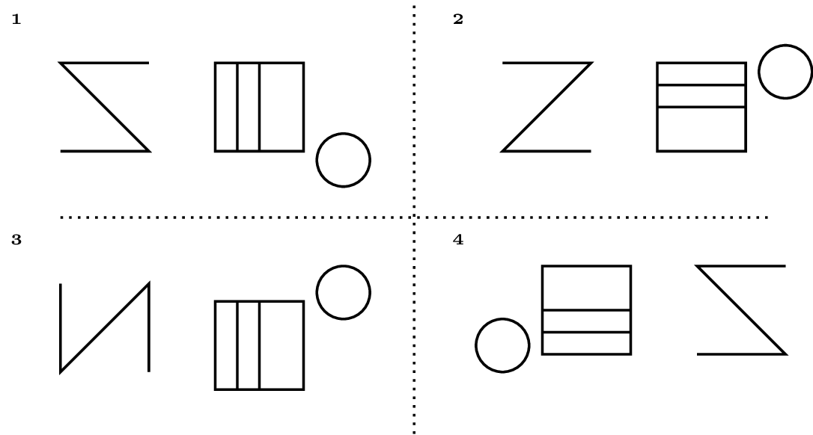

Om leermoeilijkheden bij kinderen te identificeren, kan het **visueel geheugen** onderzocht worden via de <a href="https://en.wikipedia.org/wiki/Benton_Visual_Retention_Test" target="_blank">Benton Visual Retention Test</a> (BVRT). Er zijn verschillende varianten van deze test, maar één variant werkt als volgt. Het kind krijgt tien afbeeldingen gelijkaardig aan onderstaande gedurende tien seconden te zien. 

{:data-caption="Een voorbeeldkaart uit de BVRT methode M." .light-only width="292px"}

{:data-caption="Een voorbeeldkaart uit de BVRT methode M." .dark-only width="292px"}

Daarna moet hij/zij deze afbeelding trachten te selecteren uit vier mogelijkheden.

{:data-caption="Voorbeeldoplossingen uit de BVRT methode M." .light-only width="760px"}

{:data-caption="Voorbeeldoplossingen uit de BVRT methode M." .dark-only width="760px"}

De onderzoeker telt vervolgens het aantal correcte antwoorden. Deze score vormt de basis voor statistische analyses die kunnen onthullen welke kinderen leermoeilijkheden hebben.

## Gegeven

Uit grootschalig onderzoek bepaalde men de volgende kansverdeling voor de score $$X$$ uit de Benton Visual Retention Test.

|-------------------------------|:-------:|:-------:|:-------:|:-------:|:-------:|:-------:|:-------:|:-------:|:-------:|:-------:|:-------:|
| score $$x_i$$                 | 0       | 1       | 2       | 3       | 4       | 5       | 6       | 7       | 8       | 9       | 10      |
| kans $$\mathcal{P}(X = x_i)$$ | 0.00013 | 0.00158 | 0.01094 | 0.04328 | 0.11205 | 0.20140 | 0.24922 | 0.21341 | 0.12184 | 0.04003 | 0.00612 |
{:class="table table-striped table-condensed" style="width:auto;margin-left:auto;margin-right:auto;"}

## Gevraagd

Maak twee vectoren `scores` en `kansen` die de corresponderende waarden bevatten.

Maak een staafdiagram van deze kansverdeling. Geef de horizontale as het label `Score` en de vertical as `Kans`.