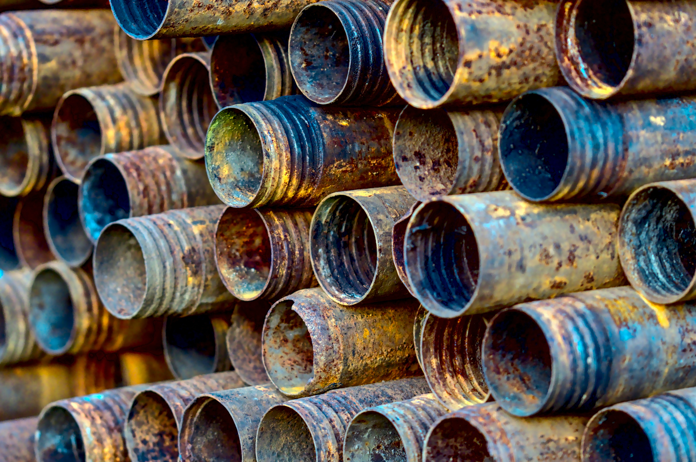

## Het belang van spreiding

In het artikel <a href="https://ipn.elsevierpure.com/en/publications/predictive-model-for-pitting-corrosion-in-buried-oil-and-gas-pipe" target="_blank">Predictive model for pitting corrosion in buried oil and gas pipelines</a> onderzocht men welke invloed de grondsoort heeft op de corrosie  (roest) van een pijpleiding.

{:data-caption="Buizen met corrosie." width="45%"}

